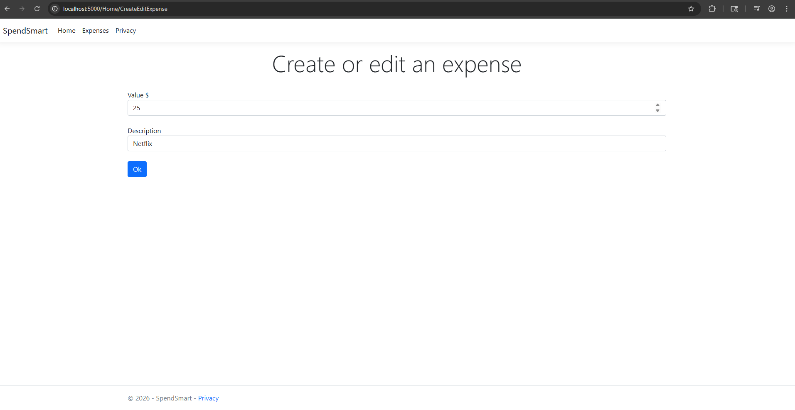
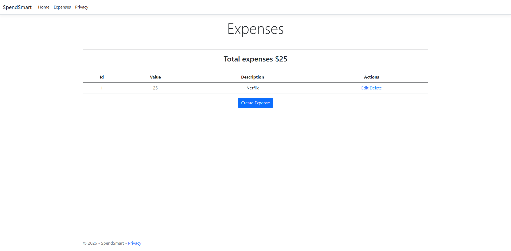

# Expense Manager (ASP.NET 8 MVC)

A simple **Expense Manager web application** built with **ASP.NET Core 8 MVC**. Built along with YouTube tutorial.

This project allows users to track and categorize their expenses in the simplest way possible, while also serving as a hands-on learning project for ASP.NET MVC fundamentals.




## 🚀 Features

- Add, edit, and delete expenses
- Categorize expenses (e.g. Food, Rent, Entertainment)
- View a list of all recorded expenses
- Total Sum of Expenses
- Server-side validation
- Clean MVC architecture
- Responsive UI using Razor Views

---

## 🛠️ Tech Stack

- **Framework:** ASP.NET Core 8 (MVC)
- **Language:** C#
- **Frontend:** Razor Views, HTML, CSS
- **Database:** Entity Framework Core (Code First)
- **IDE:** Visual Studio 2022+ or Visual Studio Code

---

## 📂 Project Structure

```
ExpenseManager/
│
├── Controllers/ # Handles HTTP requests and application logic
├── Models/ # Domain models (Expense, Category, etc.)
├── Views/ # Razor views (UI)
├── Data/ # DbContext and database configuration
├── wwwroot/ # Static files (CSS, JS, images)
└── Program.cs # Application configuration and startup
```

## ⚙️ Getting Started

### Prerequisites

- .NET 8 SDK
- Visual Studio 2022+ or Visual Studio Code
- SQL Server or SQLite (depending on configuration)

### Installation (sample)

1. Clone the repository:
   ```bash
   git clone https://github.com/your-username/expense-manager.git
   ```

2. Navigate to the project directory:
    ```bash
    cd expense-manager
    ```

3. Restore dependencies:
    ```bash
    dotnet restore
    ```

4. Apply database migrations:
    ```bash
    dotnet ef database update
    ```

5. Run the application:
    ```bash
    dotnet run
    ```

6. Open your browser and navigate to:
    ```bash
    https://localhost:5000
    ```

## 🎯 Project Goals

### This project was created to:
- Practice ASP.NET Core MVC
- Learn Entity Framework Core
- Implement CRUD operations
- Gain experience building full-stack web applications
